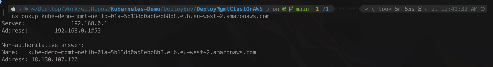
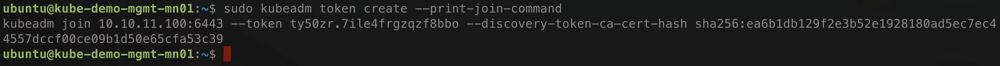
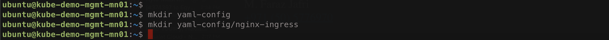

# Deploy The First - MGMT - Kubernetes Cluster With kubeadm

This Repo is to provide automation scripts and a step-by-step guide to build the first kubernetes cluster for the demo environment. This cluster will act as a management cluster configured with kubeadm and holds all management components such as the **Rancher Manager**.

---

<p align="center">
    
</p>

---

## Repo Overview

> Management Cluster - \[Kubeadm\]

This repo provides the first step towards building a demo environment to be used to show the benefits, features, and use cases of the Rancher solutions. The Demo environment consists of three environments all hosted on AWS. This environment is called the **Management Cluster**. This repo will provide automation scripts along with a step-by-step guide to deploy the management cluster.

Please follow the steps listed below to build the management cluster.

---

## Environment Architecture  

The architecture of this environment is based on and AWS three EC2 instance deployed in a single region, single availability zones, and a single VPC. In this VPC there will be 2 subnets, public subnet and a private subnet. This is based on AWS architecture guide lines where the public subnet will be exposed to the internet to accept traffic from outside and the private subnet will hold all components and will be segregated from the internet traffic. The public subnet will have a NAT gateway and a Load Balancer to forward traffic coming in or going out of the environment. 

The three EC2 instance will then be configured with kubeadm to create a kubernetes cluster that will act as the management cluster and will hold all management components such as the **Rancher Manager**. All prerequisite will be installed and configured on this cluster such as Helm, Ingress, and more.

The architecture will be as follow:
* One AWS Region - by default London Region - eu-west-2
* One AWS Availability zone - by default the first AZ in the region
* On VPC with the CIDR of 10.10.0.0/16 - default name is of kube-demo-mgmt-vpc-01
* Two Subnets
  - Public Subnet with the CIDR of 10.10.10.0/24 - default name is kube-demo-mgmt-pub-sub-01
  - Private Subnet with the CIDR of 10.10.11.0/24 - default name is kube-demo-mgmt-priv-sub-01
* Two Security Groups (One for each subnet)
  - Public Security Group allow tcp ports 22, 443, 6443 from any, any port from 10.10.0.0/16 - default name is kube-demo-mgmt-pub-sg-01
  - Private Security Group allowing any port from 10.10.0.0/16 - default name is kube-demo-mgmt-priv-sg-01
* NAT Gateway deployed in the public subnet and act as the GW for the private subnet - default name is of kube-demo-mgmt-ngw-01
* Internet Gateway attached to the VPC - default name is of kube-demo-mgmt-igw-01
* Two Routing tables (One for each subnet)
  - Public Routing Table pointing to the Internet Gateway as the default gateway - default name is of kube-demo-mgmt-pub-rt-01
  - Private Routing Table pointing to the NAT Gateway as the default gateway - default name is of kube-demo-mgmt-priv-rt-01
* Network Load Balancer deployed in the public subnet for incoming traffic to the Master Node - default name is of kube-demo-mgmt-nlb-01
* Load Balancer Target Groups for the SSH traffic coming to the Master Node

> Below PIC is a LLD for the Environment Architecture

---

<p align="center">
    
</p>

---

## Pre-Requisites  

To be able to follow along with this below step-by-step guid, several pre-requisites must be available first.
1. Download this Repo to your local machine (preferred to download the full repository not only this sub-repo)
2. AWS CLI version 2 to be installed
3. JQ to be installed
4. AWS account with sufficient privilege (preferred admin privilege)
5. AWS STS Token or account credentials to be configured for the AWS CLI

> Please Note: The used script in this repo is only tested on a MacBook, development is taking place to ensure success of the used scripts on other operating systems

---

## Step-By-Step Guide

Please follow the below step-by-step guide to deploy the Management Cluster

> Summary 

1. Step 1: Deploy AWS Infrastructure using provided bash/AWS CLI script - [Link](#Step-1---Deploy-AWS-Infrastructure)
2. Step 2: Install Kubernetes Cluster on EC2 Instances using provided bash/Kubeadm script - [Link](#Step-2---Install-Kubernetes-Cluster-on-EC2-Instances)
3. Step 3: Install Ingress on the Kubernetes Cluster using provided step-by-step guide - [Link](#Step-3---Install-Ingress-on-the-Kubernetes-Cluster)
4. Step 4: Install Helm in your kubernetes using provided step-by-step guide - [Link](#Step-4---Install-Helm-in-your-kubernetes)
5. Step 5: Deploy and Install Cert Manager through Helm using provided step-by-step guide - [Link](#Step-5---Deploy-and-Install-Cert-Manager-through-Helm)
6. Step 6: Deploy Rancher through Helm using provided step-by-step guide - [Link](#Step-6---Deploy-Rancher-through-Helm)

---

### Step 1 - Deploy AWS Infrastructure

First step in this guide is to deploy the AWS infrastructure based on the provided architecture. To help in this process, and automation script is provided in this [link](https://github.com/tahershaker/Kubernetes-Demo/blob/main/DeployEnv/DeployMgmtClustOnAWS/AwsDeployMgmtCluster.sh) that will automatically deploy all the AWS infrastructure. Please Note: To run the script, first you need to download the repo and add the AWS credentials to the AWS CLI.

Unfortunately, all the variables are hard-coded in to the script and development is in place to allow passing argument to the script to provide the ability to change the variables. These variable will hold the Region, Name Prefix, IP Addresses, Folder Location and more. List of the variables that are hard-coded are:

```bash
S_DIR=$(dirname "$0") # Get PWD of the running Script
MN01_1_CONF="${S_DIR}/ConfigFiles/kube-demo-mn01.yml" # Add File path for the CloudInit config file for the master node
WN01_1_CONF="${S_DIR}/ConfigFiles/kube-demo-wn01.yml" # Add File path for the CloudInit config file for the first worker node
WN02_1_CONF="${S_DIR}/ConfigFiles/kube-demo-wn02.yml" # Add File path for the CloudInit config file for the second worker node
REGION="eu-west-2" #Add default for the region to be London Region
AZ1="${REGION}a" # Add defualt Availability Zone
OWNER="Taher" #Add default for the owner to be Taher
PREFIX="kube-demo-Mgmt-" #Add default for the prefix used with the names of all resources to be kube-demo-
TAG="kube-demo" #Add default for the TAG added to all resources to be kube-demo
FOLDER="/Users/shakert/Downloads/" #Add default for the output folder to be /Users/shakert/Downloads/
AMI="ami-0ff1c68c6e837b183" #Add default for the AMI ID to be ami-02556c56aa890545b - Ubuntu Server 20.04 LTS (HVM), SSD Volume Type 64-bit x86
KEYPAIR_NAME="kube-demo-key-pairs" #Add default for the Key-Pair name to be kube-demo-key-pairs
KEYPAIR_FILE="${FOLDER}${KEYPAIR_NAME}.pem" # Add default folder path to download EC2 Key-Pair if not exist
VPC_NAME="${PREFIX}vpc-01" # Add default name for VPC
SUBNET1_NAME="${PREFIX}pub-sub-01" # Add default name for Public Subnet
SUBNET1A_NAME="${PREFIX}priv-sub-01" # Add default name for Private Subnet
PUBRT_NAME="${PREFIX}pub-rt-01" # Add default name for Public Subnet routing table
PRIVRT1_NAME="${PREFIX}priv-rt-01" # Add default name for Private Subnet Routing Table
PUBSGROUP_NAME="${PREFIX}pub-sg-01" # Add default name for Public Security Group
PRIVSGROUP_NAME="${PREFIX}priv-sg-01" # Add default name for Private Security Group
EIP1_NAME="${PREFIX}eip-01" # Add default name for Elastic IP
IGW_NAME="${PREFIX}igw-01" # Add default name for Internet Gateway
NATGW1_NAME="${PREFIX}ngw-01" # Add default name for NAT Gateway
NETLB1A_NAME="${PREFIX}netlb-01a" # Add default name for Network Load Balancer
LB1_SSH_TG_NAME="${PREFIX}01-ssh-tg-01" # Add default name for load Balancer target group for SSH
LB1_Kubectl_TG_NAME="${PREFIX}01-kube-tg-01" # Add default name for load Balancer target group for Kubectl
MHOST_DISK_CONFIG='DeviceName=/dev/sda1,Ebs={VolumeSize=90,DeleteOnTermination=true}'
WHOST_DISK_CONFIG='DeviceName=/dev/sda1,Ebs={VolumeSize=70,DeleteOnTermination=true}'
MNODE1A_NAME="${PREFIX}01-master-01" # Add default name for Master Node
MNODE1A_IP="10.10.11.100" # Add default IP address for Master Node
WNODE1A_NAME="${PREFIX}01-worker-01" # Add default name for Worker Node 1
WNODE1A_IP="10.10.11.101" # Add default IP address for worker Node 1
WNODE1B_NAME="${PREFIX}01-worker-02" # Add default name for Worker Node 2
WNODE1B_IP="10.10.11.102" # Add default IP address for Worker Node 2
JSON_FILE="${FOLDER}resources-ids-$(date '+%Y-%m-%d-%H-%M-%S').json"
```

1. Navigate to the script location and make the script file excusable, Script name is AwsDeployMgmtCluster.sh

```bash 
chmod u+x AwsDeployMgmtCluster.sh
```
<p align="center">
    
</p>

2. Run the Script, Please Note: Running the script is going to take several minutes.

```bash
./AwsDeployMgmtCluster.sh
```
<p align="center">
    
</p>

3. Get the Public FQDN and IP of the Load balancer.

- Once the script successfully completed, it will print the public FQDN of the load balancer at the end of the script. Copy this IFQDN and save it somewhere. Also use nslookup to get the IP of the FQDN and save it with the FQDN.
```bash 
nslookup <fqdn>
```
<p align="center">
    
</p>

- The Output of starting the script should look like
<p align="center">
    
</p>

- The output of the end of the script should look like
<p align="center">
    
</p>

---

### Step 2 - Install Kubernetes Cluster on EC2 Instances

Second Step we will be installing a Kubernetes Cluster using provided 2 scripts - [Master Node Installation Script](https://github.com/tahershaker/Kubernetes-Demo/blob/main/DeployEnv/DeployMgmtClustOnAWS/InstallFiles/InstallMasterNode.sh) & [Worker Node Installation Script](https://github.com/tahershaker/Kubernetes-Demo/blob/main/DeployEnv/DeployMgmtClustOnAWS/InstallFiles/InstallWrokerNode.sh) - that uses kubeadm to install and configure the kubernetes cluster.

Please Note: In this step we will be accessing the Master Node using SSH, the KeyPair to be used with the SSH should be already in our local machine. Either you already have it or the script above will create it and download it to your local machine. By default the script will download it in the location where you ran the script and will have the name of kube-demo-key-pairs

1. Change the permissions of the SSH KeyPair file
```bash
chmod 400 kube-demo-key-pairs.pem
```
<p align="center">
    
</p>

2. Open the content of the KeyPair file and save is in a note pad
```bash
cat kube-demo-key-pairs.pem
```
<p align="center">
    
</p>

3. Open 3 SSH sessions to the Master Node using the Load Balancer Public IP you got from the output of the previous script (you should have saved it somewhere)
```bash
ssh -i "kube-demo-key-pairs.pem" ubuntu@<Load-Balancer-Public-IP>
```
<p align="center">
    
</p>

4. In the First SSh session to the Master node, create a file with the same name as the KeyPair file and past the content of the Key that you have saved it in a note pad after executing point number 2. The change the permission of the SSH KeyPair file ou have just created the same way you did in point number 1
```bash
touch kube-demo-key-pairs.pem
vi kube-demo-key-pairs.pem
```
<p align="center">
    
</p>

5. In the second and third SSH session to the Master Node, SSH to the first and second worker nodes
   - SSH to the first worker node
   ```bash
   ssh -i "kube-demo-key-pairs.pem" ubuntu@kube-demo-mgmt-wn01
   ```
   - SSH to the first worker node
   ```bash
   ssh -i "kube-demo-key-pairs.pem" ubuntu@kube-demo-mgmt-wn02
   ```
<p align="center">
    
</p>

6. Now we need to install Kubernetes components on the Master node, you can copy and past the script provided in this [link](https://github.com/tahershaker/Kubernetes-Demo/blob/main/DeployEnv/DeployMgmtClustOnAWS/InstallFiles/InstallMasterNode.sh) or use the below command in the first SSH session you opened to the Master node. Leave the script to run and monitor for any exceptions.
```bash
curl https://raw.githubusercontent.com/tahershaker/Kubernetes-Demo/main/DeployEnv/DeployMgmtClustOnAWS/InstallFiles/InstallMasterNode.sh | bash
```
<p align="center">
    
</p>

7. Now we need to install Kubernetes components on the 2 Worker nodes, you can copy and past the script provided in this [link](https://github.com/tahershaker/Kubernetes-Demo/blob/main/DeployEnv/DeployMgmtClustOnAWS/InstallFiles/InstallWrokerNode.sh) or use the below command in the second and third SSH session you opened to the first and second worker nodes. Leave the script to run and monitor for any exceptions.
```bash
curl https://raw.githubusercontent.com/tahershaker/Kubernetes-Demo/main/DeployEnv/DeployMgmtClustOnAWS/InstallFiles/InstallWrokerNode.sh | bash
```
<p align="center">
    
</p>

8. After all the scripts are successfully completed, on the SSH session to the Master Node, you should have the kubeadm join command, if you done use the below command to get the join command.
```bash
sudo kubeadm token create --print-join-command
```
<p align="center">
    
</p>

9. Take the output of the join command and add sudo to the beginning of it and run it on the first and second worker nodes through the SSH session you have already opened or re-open if closed.
<p align="center">
    
</p>

10. Install Calico CNI on Master node, copy and past the below command on the SSH Session for the Master Node
```bash
kubectl apply -f https://raw.githubusercontent.com/projectcalico/calico/v3.26.1/manifests/calico.yaml
```

11. Check the kubernetes cluster status and get the node using the below command form the SSH session of the Master node. The below command show give you 3 nodes (1 master, 2 workers) with all status are ready.
```bash
kubectl get nodes
```
<p align="center">
    
</p>

12. Ensure all pods are running with not exceptions to any pod
```bash
kubectl get pods -A
```
<p align="center">
    
</p>

---

### Step 3 - Install Ingress on the Kubernetes Cluster

In this step we will be installing Ingress on our kubernetes cluster to be used to access different applications deployed on the cluster such as the Rancher manager itself.

1. SSH to the Master node and create a folder to add all yaml files that will be used with the demo. Then create a sub-folder to download the Nginx Ingress Yaml file to it
```bash
mkdir yaml-config
mkdir yaml-config/nginx-ingress
```
<p align="center">
    
</p>

2. Open a web-browser on your local machine and download the yaml file to your local machine from this URL: https://github.com/kubernetes/ingress-nginx/blob/main/deploy/static/provider/baremetal/deploy.yaml

3. When deploying Rancher Manager using Helm Chart, note that the Rancher Helm chart does not set an `ingressClassName` on the ingress by default. Because of this, you have to configure the Ingress controller to also watch ingresses without an `ingressClassName`
- Reference: https://ranchermanager.docs.rancher.com/pages-for-subheaders/install-upgrade-on-a-kubernetes-cluster
- Reference: https://kubernetes.github.io/ingress-nginx/user-guide/k8s-122-migration/#what-is-the-flag-watch-ingress-without-class
   - To do so, we need to add the argument `--watch-ingress-without-class=true` in the downloaded yaml file.
     - Open the Yaml file with an editor of your choice (ex: VSCode)
     - After line number 424 where the container sepc section is and argument, add the argument `--watch-ingress-without-class=true`
     - Save the file after editing it
<p align="center">
    
</p>

4. In the SSH session to the master node, create a file called deploy.yaml in the folder yaml-config/nginx-ingress then copy the content of the deploy yaml file in your local machine to this file.
```bash
touch yaml-config/nginx-ingress/deploy.yaml
vi yaml-config/nginx-ingress/deploy.yaml
```
<p align="center">
    
</p>

5. Deploy the Nginx Ingress Controller
```bash
kubectl apply -f yaml-config/nginx-ingress/deploy.yaml
```
<p align="center">
    
</p>

6. Ensure Nginx Ingress Controller pod is running
```bash
kubectl get pods -n ingress-nginx
```
<p align="center">
    
</p>

7. Get the port numbers that Ingress listen for port 80 and 443 and save them somewhere
```bash
kubectl get services ingress-nginx-controller --namespace=ingress-nginx
```
<p align="center">
    
</p>

8. In AWS, create 2 Target Groups (one for http port 80 and one for https port 443) with the port number you got from the above ingress output commands and register the master node with these target groups
   - In AWS console, the search bar, type EC2 and click on it, then click on Target Groups under Load Balancing and then click on create target group.

<p align="center">
    
</p>

   - Configure the target group with the below configuration
     - Choose a target type: `instance`
     - Target group name: `kube-demo-mgmt-http-tg-01`
     - Protocol: Port: `TCP - 80`
     - VCP: `Choose kube-demo-mgmt-vcp-01`
     - Click Next
     - In the Available Instance, Click on the master node check box.
     - In the Ports for the selected instances, enter the port associated with port 80 from the above ingress output commands
     - Click Include as pending below button then click create target group

<p align="center">
    
</p>

<p align="center">
    
</p>

   - Configure a Listener on the Load Balancer pointing to this target Group
     - Click on Load balancer, Listener, then Add Listener 
     - In the Listener details, Default Action Choose kube-demo-mgmt-http-tg-01, then click add

<p align="center">
    
</p>

   - Repeat the above to create another Target group with the below configuration 
     - - Choose a target type: `instance`
     - Target group name: `kube-demo-mgmt-https-tg-01`
     - Protocol: Port: `TCP - 443`
     - VCP: `Choose kube-demo-mgmt-vcp-01`
     - In the Ports for the selected instances, enter the port associated with port 443 from the above ingress output commands

<p align="center">
    
</p>

9. Test Ingress is working properly
   - On the SSh Session to the master node, create a file in the directly yaml-config/nginx-ingress with the name test-ingress.yaml, then edit this file and copy the content of the yaml file in this [link](https://github.com/tahershaker/Kubernetes-Demo/blob/main/DeployEnv/DeployMgmtClustOnAWS/YamlFiles/TestIngress.yaml) and past it in the file you just created. Once pasted the content, change the `<put-your-loadbalancer-fqdn-here>` with your load balancer public IP FQDN that you got from running the first script which you should have saved it somewhere. The apply the file using `kubectl apply -f file-name.yaml` command
```bash
touch yaml-config/nginx-ingress/test-ingress.yaml
vi yaml-config/nginx-ingress/test-ingress.yaml
kubectl apply -f yaml-config/nginx-ingress/test-ingress.yaml
```
<p align="center">
    
</p>

<p align="center">
    
</p>
 
   - Check the Ingress is deployed properly 
```bash
kubectl get ingress nginx-test-ingress -n nginx-testing
```
<p align="center">
    
</p>

   - Open the URL to check if the implementation is working properly using the URL `http://kube-demo-mgmt-netlb-01a-b940619f91deacbc.elb.eu-west-2.amazonaws.com/nginx`

<p align="center">
    
</p>

---

### Step 4 - Install Helm in your kubernetes

In this step we will be installing Helm on our kubernetes cluster. As we are going to deploy multiple applications, it is easier to use Helm charts to deploy them. Also Rancher Manager is deployed through a Helm Chart. To install Helm , we will install Helm CLI using the below command. 
- References: https://helm.sh/docs/intro/install/
1. From the SSH Session to the Master Node copy and past the below command to install Helm. You can then check the installation using the command `helm version`
```bash
curl https://raw.githubusercontent.com/helm/helm/main/scripts/get-helm-3 | bash
```
<p align="center">
    
</p>

---

### Step 5 - Deploy and Install Cert Manager through Helm

In this step we will be deploying Cert Manager in our kubernetes cluster. As Rancher management server is designed to be secure by default and requires SSL/TLS configuration, we will be installing Cert Manager to you kubernetes cluster using Helm charts. On the Master Node using the SSH Session, do the following:
- References: https://cert-manager.io/docs/installation/helm/

1. Add repo to helm to download Cert manager from and update Helm
```bash
helm repo add jetstack https://charts.jetstack.io
helm repo update
```

<p align="center">
    
</p>

2. Install required Customer Resource Definitions 
```bash
kubectl apply -f https://github.com/cert-manager/cert-manager/releases/download/v1.13.2/cert-manager.crds.yaml
```

<p align="center">
    
</p>

3. Install Cert Manager using Helm
```bash
helm install \
  cert-manager jetstack/cert-manager \
  --namespace cert-manager \
  --create-namespace \
  --version v1.13.2 
```

<p align="center">
    
</p>

4. Check all pods are running properly
```bash
kubectl get pods -n cert-manager
```
<p align="center">
    
</p>

---

### Step 6 - Deploy Rancher through Helm

In this step we will be deploying the Rancher Manager on out kubernetes cluster. Rancher is installed using the Helm package manager for Kubernetes.
- References: https://ranchermanager.docs.rancher.com/pages-for-subheaders/install-upgrade-on-a-kubernetes-cluster

1. Add the Helm Chart Repository - We will use the Sable version
```bash
helm repo add rancher-stable https://releases.rancher.com/server-charts/stable
```

<p align="center">
    
</p>

2. Create a Namespace for Rancher
```bash
kubectl create namespace cattle-system
```
<p align="center">
    
</p>

3. Install Rancher Using Helm, Change the Put-FQDN with the FQDN of the load balancer you get from the output of the first script where you should have saved it somewhere
```bash
helm install rancher rancher-stable/rancher \
  --namespace cattle-system \
  --set hostname=<Put-FQDN> \
  --set bootstrapPassword=admin
```
<p align="center">
    
</p>

4. Check if deployment is rolled out
```bash
kubectl -n cattle-system rollout status deploy/rancher
```
<p align="center">
    
</p>

5. Open a browser on your local machine and go to the https://LB-FQDN - You should now see the default initial config page of Rancher.
<p align="center">
    
</p>

6. Put the required initial configuration and click continue - You now should be ready to use Rancher
<p align="center">
    
</p>

---

One all the above steps are completed, you now have a fully functional kubernetes cluster with Rancher deployed on it.

---

**Enjoy** :blush: