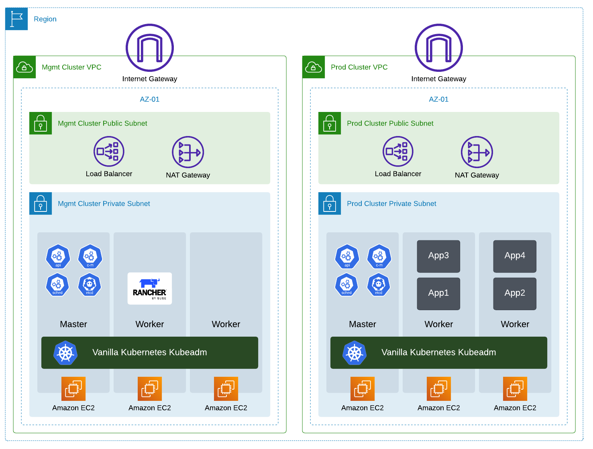

# Deploying Demo Environment

This Repo is created to hold several sub-repos that list automation scripts and step-by-step guides to build and deploy the demo environment. 

---

    

---

## Repo Overview 

As a Solution Architect, you are asked to perform multiple **_Demos_** and **_Online Sessions_** to customers, partners, or new prospects. Delivering the **_Demos_** and **_Online Sessions_** requires having a Kubernetes environment up and running with Rancher solutions installed, and depending on the audience, some advanced features may need to be configured. Once the Kubernetes environment is built and Rancher is installed with the required advanced features configured, then you may use it as a lab for the **_Demos_** and **_Online Sessions_**.

This repo will help Solutions Architect to automate the building and the installation of the kubernetes environment along with the Rancher solution. The main objective of this repo is to add all required scripts, notes, diagrams, and step-by-step activities to perform the demo. Thus this repo will help deploying the required infrastructure, install the required solutions and applications, and list all use-cases to be perform in this demo. This repo will hold code, installation steps, configuration files, and much more to help Solution Architects build labs quickly and efficiently utilize their time. This repo will hold all the below:
* Code to automate the deployment of a Kubernetes environment (Mgmt Cluster) on AWS, this will include EC2, VPC, NAT, LB, and more.
* Code to guide and automate the installation of kubernetes CNI (Calico) and Ingress on the Mgmt Cluster
* Code to automate the installation of a kubernetes cluster (Mgmt Cluster) using kubeadm
* Code + Step-By-Step Guide to deploy Rancher Manager on the Kubernetes Mgmt Cluster
* Code to automate the deployment of a secondary kubernetes environment (RKE2 Cluster) on AWS without the installation of RKE2
* Code to automate the deployment of an EKS cluster on AWS
* Demo configuration files (such as app YAML files and more) to configure the lab with some supporting resources to show-case Rancher features.
* Explanation of Use-Cases along with the supporting configuration files.
* Several reference pages to be used to explain the functionality of the product.

**Please Note:**
> Some code available in the repo may need to be adjusted from one SA to another to match the need and the identity of the SA. This is going to be highlighted in any sub-repo available in this main repo as needed.

---

## Demo Architecture

This demo environment is built and designed in a way to give the Solution Architect the ability to show as much use-cases as possible. Thus, the demo environment is going to be built with three different environment all deployed on AWS. The three environment and the purpose of each one are listed and explained as follow:
* **First Environment** is the main and called the **Management Environment (Mgmt)**. This environment consist of three EC2 instances and all the supporting objects (VPC, NAT GW, Load Balancer, and more...) to run these EC2 instance on AWS. These three EC2 instances will run a kubernetes cluster installed using kubeadm. This kubernetes cluster will act as the management cluster that will hold the Rancher Manager, Harbor, and any other management tools required for this demo. This cluster will be added to the Rancher Manager at a later stage in this demo.
* **Second Environment** is a supporting kubernetes cluster and is called **RKE Cluster**. This environment consist of three EC2 instances and all the supporting objects (VPC, NAT GW, Load Balancer, and more...) to run these EC2 instance on AWS. These three EC2 instances will run a kubernetes cluster installed using RKE2 through the Rancher Manager. This cluster will be the main focus of the demos as it will hold all applications running to show the use cases in this demo. This cluster is going to be created through the Rancher Manager which is one of the use cases of Rancher Manager on the ease of deploying new clusters on any cloud (Public(AWS, GCP, Azure) or Private(VMware)).
* **Third Environment** is a supporting kubernetes cluster and is called **EKS Cluster**. This environment consist of an EKS cluster with only two nodes (Workers) and the only purpose is to show the use case of Rancher manager on the capability of Multi-Cloud Management and the supportability of EKS, GKE, and AKS clusters.

> Below PIC provide a high-level design of the demo lab infrastructure

---

    

---

## Repo Usability

To use this repo, there are several steps to be executed which most of the are automated. Once all steps listed below are completed, then the solution architect will have a functional demo environment to start showing the use cases of the solutions.

> Step-By-Step

---

1. Deploy The Management Environment and Install all Required Components
   - To complete this step, please complete all actions listed in this [link](https://github.com/tahershaker/Kubernetes-Demo/tree/main/DeployEnv/DeployMgmtClustOnAWS).
   - Once this is completed, the management cluster will be up and running and all management components (including Rancher Manager) will be deployed.
2. Deploy the RKE Environment
   - To complete this step, please complete all actions listed in this [link](https://github.com/tahershaker/Kubernetes-Demo/tree/main/DeployEnv/DeployRkeClusterOnAWS).
3. Deploy the EKS Environment
   - To complete this step, please complete all actions listed in this [link](https://github.com/tahershaker/Kubernetes-Demo/tree/main/DeployEnv/DeployEksClusterOnAWS).

---

Once the above tasks are completed successfully, you can start with the Demo and showing the Use cases. 

_Please Note:_ During the completion of the above tasks, some of the use cases may have been already covered such as deploying an RKE cluster through Rancher Manager or linking an EKS cluster to Rancher Manager.

To help with th demo and showing the use cases, please refer to this [link](https://github.com/tahershaker/Kubernetes-Demo/tree/main/UseCases)

---