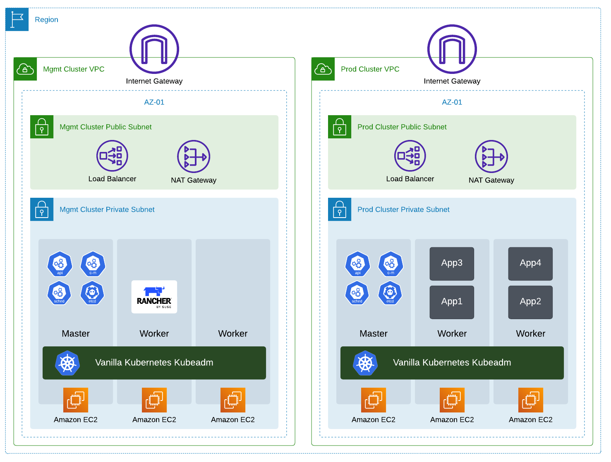

# Kubernetes Demo with Rancher Solutions

This Repo is created to provide a level of understanding of **Rancher** solutions offerings, cloud-native architecture, and building a CI/CD pipeline with Rancher product offerings.

---

    

---

## Purpose of this Repo

The purpose of this repo is to heal ease the demo process. The main objective of a demo is to show the capabilities and the use-cases of a solution. To do so, this solution must be up and running to be able to use it and perform the demo. 

The main objective of this repo is to add all required scripts, notes, diagrams, and step-by-step activities to perform the demo. Thus this repo will help deploying the required infrastructure, install the required solutions and applications, and list all use-cases to be perform in this demo. This repo will hold scripts and step-by-step guid to deploy and configure the infrastructure and solutions to effectively perform the demo.

---

## Demo Architecture

Below PIC provide a high-level design of the demo lab infrastructure

---

    

---